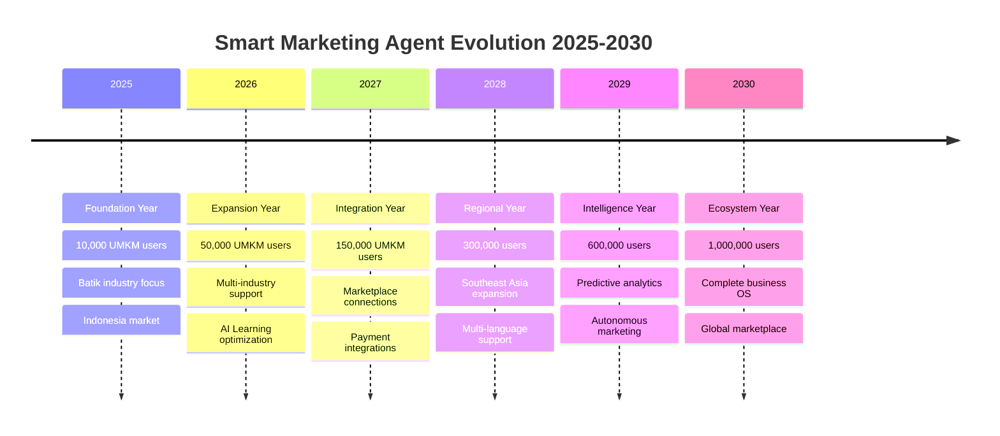

# BAB 9
# FUTURE ROADMAP

## 9.1 Visi Smart Marketing Agent 2025-2030

Smart Marketing Agent lahir dari mimpi sederhana: memberdayakan UMKM Indonesia dengan teknologi yang accessible. Setelah melihat transformasi nyata di ratusan UMKM batik, visi kami berkembang menjadi lebih besar - menjadi backbone digital untuk seluruh ekosistem UMKM Indonesia dan beyond.

### The Big Vision

```
2025-2030 VISION STATEMENT:

"Menjadi AI-powered business companion terpercaya untuk 
1 juta UMKM di Southeast Asia, enabling them to compete 
globally while preserving local wisdom and values."

CORE PILLARS:
1. INTELLIGENCE - Semakin pintar memahami bisnis lokal
2. ACCESSIBILITY - Semakin mudah untuk semua level users  
3. SCALABILITY - Dari warung hingga enterprise
4. SUSTAINABILITY - Bisnis dan lingkungan berkelanjutan
5. COMMUNITY - Ekosistem saling support dan grow
```

### Milestone Journey



## 9.2 Fitur-Fitur yang Akan Datang

### Q3 2025: Enhanced AI Capabilities

**1. Multi-Modal Content Generation**
```typescript
interface MultiModalContent {
  text: {
    whatsapp: string
    instagram: string
    email: string
  }
  visuals: {
    productPhotos: AIGeneratedImage[]
    styleGuides: FashionTemplate[]
    catalogLayouts: DesignTemplate[]
  }
  video: {
    productShowcase: ShortVideo
    customerTestimonial: VideoTemplate
    behindTheScenes: StoryFormat
  }
  voice: {
    voiceNoteScript: AudioMessage
    podcastContent: AudioScript
  }
}

// Example usage
const campaignContent = await generateMultiModal({
  product: "Batik Parang Exclusive",
  segment: "champions",
  objective: "new_collection_launch",
  channels: ["whatsapp", "instagram", "email"],
  includeVisuals: true,
  includeVideo: true
})
```

**2. Conversational AI Assistant**
```javascript
// In-app AI assistant untuk mitra UMKM
const AIAssistant = {
  capabilities: [
    "Answer business questions in Bahasa",
    "Provide real-time suggestions",
    "Walk through complex features",
    "Troubleshoot issues",
    "Generate reports on-demand"
  ],
  
  exampleInteractions: [
    {
      user: "Kenapa penjualan bulan ini turun?",
      ai: "Berdasarkan data, ada 3 faktor utama:
           1. 45 pelanggan Champions masuk At Risk
           2. Campaign response rate turun 20%
           3. Competitor baru di area Anda
           
           Saya sarankan win-back campaign untuk 
           At Risk customers. Mau saya buatkan?"
    },
    {
      user: "Buatkan strategi untuk Lebaran tahun ini",
      ai: "Based on last year's data dan market trends,
           here's your Lebaran 2026 strategy:
           [Detailed month-by-month plan]"
    }
  ]
}
```

### Q4 2025: Smart Inventory Management

**Predictive Stock Management**
```typescript
interface InventoryIntelligence {
  demandForecasting: {
    predictSales(product: Product, timeframe: Timeframe): SalesPrediction
    seasonalAdjustments(historical: SalesData): SeasonalPattern
    eventBasedPredictions(upcomingEvents: Event[]): DemandSpike[]
  }
  
  stockOptimization: {
    reorderPoints: Map<Product, Quantity>
    suggestedOrders: PurchaseOrder[]
    overstockAlerts: Product[]
    deadStockIdentification: Product[]
  }
  
  supplierIntegration: {
    autoReorder: boolean
    preferredSuppliers: Supplier[]
    priceTracking: PriceHistory
    leadTimeOptimization: SupplierPerformance
  }
}
```

**Visual Dashboard**
```
📊 INVENTORY DASHBOARD
=======================
Current Stock Value: Rp 125,000,000

⚠️ ALERTS:
- Batik Mega Mendung low stock (2 weeks supply)
- Batik Kawung overstocked (6 months supply)
- Seasonal surge expected in 30 days

📈 PREDICTIONS:
Next 30 days sales: Rp 45,000,000
Recommended orders: 5 items worth Rp 20,000,000
Cash flow impact: Positive Rp 25,000,000

🎯 ACTIONS:
[Order Now] [Adjust Later] [View Details]
```

### Q1 2026: Marketplace Integration Hub

**One-Click Multi-Channel Listing**
```javascript
const marketplaceHub = {
  supportedPlatforms: [
    "Tokopedia",
    "Shopee", 
    "Lazada",
    "Blibli",
    "TikTok Shop",
    "Facebook Shop",
    "Instagram Shop",
    "WhatsApp Business"
  ],
  
  features: {
    bulkListing: "List products to all platforms in one click",
    inventorySync: "Real-time stock synchronization",
    orderManagement: "Centralized order processing",
    pricingStrategy: "Dynamic pricing per platform",
    reviewAggregation: "Collect reviews from all sources",
    analyticsUnified: "Single dashboard for all channels"
  },
  
  automation: {
    autoReply: "Platform-specific auto responses",
    orderRouting: "Smart fulfillment routing",
    promotionSync: "Coordinated campaign across channels",
    customerUnification: "Single customer view across platforms"
  }
}
```

### Q2 2026: Financial Intelligence

**Integrated Financial Management**
```typescript
interface FinancialIntelligence {
  cashFlowManagement: {
    currentPosition: CashPosition
    projections: CashFlowForecast[]
    alerts: CashFlowAlert[]
    recommendations: FinancialAdvice[]
  }
  
  profitabilityAnalysis: {
    productProfitability: Map<Product, ProfitMargin>
    customerProfitability: Map<Customer, LifetimeValue>
    channelProfitability: Map<Channel, ROI>
    recommendations: OptimizationSuggestion[]
  }
  
  taxCompliance: {
    automaticReporting: TaxReport[]
    deadlineReminders: TaxDeadline[]
    optimizationTips: TaxSaving[]
    digitalInvoicing: E_Invoice
  }
  
  fundingOpportunities: {
    eligibilityCheck: LoanEligibility
    partnerLenders: Lender[]
    applicationAssistance: LoanApplication
    repaymentTracking: LoanManagement
  }
}
```

## 9.3 Integrasi Marketplace

### The Connected Commerce Ecosystem

```
                    SMART MARKETING AGENT
                           HUB
    ┌─────────────────────────┴─────────────────────────┐
    │                                                   │
    │  ┌─────────────┐  ┌─────────────┐  ┌───────────┐ │
    │  │  INVENTORY  │  │  CUSTOMER   │  │ ANALYTICS │ │
    │  │  SYNC       │  │  UNIFIED    │  │ CENTRAL   │ │
    │  └─────────────┘  └─────────────┘  └───────────┘ │
    │                                                   │
    └─────┬───────┬───────┬───────┬───────┬───────┬───┘
          │       │       │       │       │       │
    ┌─────▼──┐ ┌──▼──┐ ┌──▼──┐ ┌──▼──┐ ┌──▼──┐ ┌──▼──┐
    │SHOPEE  │ │TOKO │ │LAZA │ │TIKTOK│ │ FB  │ │WA   │
    │        │ │PEDIA│ │ DA  │ │ SHOP │ │SHOP │ │BIZ  │
    └────────┘ └─────┘ └─────┘ └──────┘ └─────┘ └─────┘
```

### Implementation Phases

**Phase 1: Read Integration (Q1 2026)**
- Import orders from marketplaces
- Sync customer data
- Unified analytics dashboard
- Review aggregation

**Phase 2: Write Integration (Q2 2026)**
- Push product listings
- Sync inventory real-time
- Update pricing centrally
- Coordinate promotions

**Phase 3: Smart Automation (Q3 2026)**
- Auto-reply customers
- Smart order routing
- Dynamic pricing by platform
- Unified campaign management

**Phase 4: AI Optimization (Q4 2026)**
- Platform performance prediction
- Optimal listing recommendations
- Customer journey tracking
- Revenue maximization AI

### Benefits for Mitra UMKM

```
BEFORE INTEGRATION:
😫 Login 6 different platforms
😫 Manual stock update everywhere  
😫 Confused tracking orders
😫 Inconsistent pricing
😫 Scattered customer data
😫 Cannot see big picture

AFTER INTEGRATION:
😊 Single dashboard for everything
😊 Automatic stock sync
😊 All orders in one place
😊 Smart pricing suggestions
😊 360° customer view
😊 Clear business insights

TIME SAVED: 4 hours/day → 30 minutes/day
SALES INCREASE: Average 40% from better management
```

## 9.4 Ekspansi ke UMKM Lain

### Industry Expansion Roadmap

```
2025: FASHION & TEXTILES
├── Batik (current)
├── Muslim Fashion
├── Traditional Textiles
└── Modern Apparel

2026: FOOD & BEVERAGE
├── Culinary/Catering
├── Snacks/Packaged Food
├── Beverages
└── Specialty/Organic

2027: HANDICRAFTS
├── Home Decor
├── Jewelry/Accessories
├── Art & Paintings
└── Souvenirs

2028: SERVICES
├── Beauty/Salon
├── Education/Course
├── Tourism/Travel
└── Professional Services

2029: AGRICULTURE
├── Fresh Produce
├── Processed Goods
├── Herbs/Spices
└── Floriculture

2030: FULL ECOSYSTEM
└── Any UMKM Type
```

### Industry-Specific Adaptations

**Food & Beverage Module**
```typescript
interface FoodBeverageFeatures {
  specificNeeds: {
    expiryTracking: "Alert before products expire",
    batchManagement: "Track production batches",
    recipeCosting: "Calculate exact profit margins",
    nutritionLabeling: "Generate required labels",
    halalCertification: "Manage cert requirements"
  },
  
  marketing: {
    menuDigital: "Interactive digital menu",
    seasonalCampaigns: "Holiday-specific promos",
    subscriptionBoxes: "Recurring order management",
    cateringQuotes: "Instant quote generation"
  },
  
  compliance: {
    bpomRegistration: "Track registration status",
    hygieneStandards: "Checklist management",
    deliveryCompliance: "Food safety in delivery"
  }
}
```

**Beauty & Wellness Module**
```typescript
interface BeautyWellnessFeatures {
  appointmentSystem: {
    onlineBooking: "Customer self-booking",
    staffScheduling: "Multi-staff calendar",
    reminderAutomation: "Reduce no-shows",
    waitlistManagement: "Fill cancellations"
  },
  
  customerRecords: {
    treatmentHistory: "Detailed service records",
    allergyTracking: "Safety information",
    beforeAfterPhotos: "Progress documentation",
    preferenceNotes: "Personalization data"
  },
  
  loyaltyPrograms: {
    packageDeals: "Multi-session packages",
    membershipTiers: "VIP classifications",
    referralTracking: "Incentivized referrals",
    pointsSystem: "Earn and burn mechanics"
  }
}
```

## 9.5 Teknologi Mendatang

### AI Evolution: GPT-4 to GPT-X

```
2025: GPT-4 Turbo
- Better Bahasa Indonesia understanding
- Cultural context awareness
- Multi-dialect support
- Cost optimization

2026: GPT-5 Integration
- Video content generation
- Voice synthesis natural
- Real-time translation
- Emotional intelligence

2027: Custom AI Models
- UMKM-specific training
- Industry vertical models
- Local language perfection
- Offline capability

2028: Autonomous AI
- Self-improving algorithms
- Predictive decision making
- Proactive recommendations
- Zero-prompt operations

2029: AGI Integration
- Human-level reasoning
- Complex problem solving
- Creative innovation
- Strategic planning

2030: Quantum-AI Hybrid
- Massive parallel processing
- Pattern recognition beyond human
- Instant optimization
- Future simulation
```

### Blockchain Integration

**Smart Contracts for UMKM**
```solidity
contract UMKMTransaction {
    // Automatic payment release on delivery
    function releasePayment() public {
        require(deliveryConfirmed == true);
        require(buyerSatisfied == true);
        seller.transfer(orderAmount);
    }
    
    // Dispute resolution mechanism
    function raiseDispute() public {
        require(msg.sender == buyer || msg.sender == seller);
        disputeActive = true;
        // Trigger mediation process
    }
    
    // Loyalty points on blockchain
    function awardLoyaltyPoints() private {
        uint points = calculatePoints(orderAmount);
        loyaltyToken.mint(buyer, points);
    }
}
```

**Benefits:**
- Trust in transactions
- Reduced payment fraud
- Transparent loyalty programs
- Decentralized reputation
- Cross-border payments

### AR/VR Shopping Experience

**Virtual Batik Showroom**
```javascript
const virtualShowroom = {
  features: {
    3dProductView: "Rotate and zoom batik details",
    virtualTryOn: "See how batik looks on you",
    sizeAccuracy: "AI-powered size recommendation",
    fabricSimulation: "Feel texture virtually",
    patternCustomization: "Design your own motif"
  },
  
  implementation: {
    webAR: "No app needed, browser-based",
    mobileFirst: "Optimized for smartphones",
    socialSharing: "Share virtual outfit",
    purchaseIntegration: "Buy directly from AR"
  }
}
```

### IoT Integration

**Smart Store Sensors**
```
CONNECTED DEVICES:
- Foot traffic counters
- Temperature/humidity monitors
- Smart POS systems
- RFID inventory tags
- Customer emotion sensors

DATA INSIGHTS:
- Peak shopping hours
- Product touch rates
- Conversion by location
- Environmental optimization
- Mood-based recommendations
```

## 9.6 Sustainability & Social Impact

### Green Commerce Initiative

**Carbon Footprint Tracking**
```typescript
interface SustainabilityMetrics {
  carbonFootprint: {
    perOrder: number // kg CO2
    monthlyTotal: number
    yearlyGoal: number
    offsetOptions: CarbonOffset[]
  },
  
  sustainablePractices: {
    packagingScore: 1-10
    localSourcing: percentage
    wasteReduction: metrics
    energyEfficiency: rating
  },
  
  certifications: {
    ecoLabels: Certification[]
    fairTrade: boolean
    organicStatus: boolean
    socialEnterprise: boolean
  },
  
  impact reporting: {
    jobsCreated: number
    womenEmpowered: number
    communitiesImpacted: number
    environmentSaved: metrics
  }
}
```

**Customer Awareness**
```
🌱 SUSTAINABILITY BADGE SYSTEM:

ECO WARRIOR: 80%+ sustainable practices
GREEN CHAMPION: 60-79% sustainable
EARTH FRIEND: 40-59% sustainable
GROWING GREEN: Starting journey

CUSTOMER VIEW:
"This batik supported 5 local artisans and 
saved 10L water in production. Carbon offset 
available for Rp 5,000."

[Offset My Purchase] [Learn More]
```

### Financial Inclusion

**Micro-Lending Integration**
```javascript
const microFinance = {
  partners: [
    "Bank Rakyat Indonesia",
    "Amartha",
    "Modalku",
    "KoinWorks"
  ],
  
  features: {
    creditScoring: "Based on transaction history",
    instantApproval: "Under 5 minutes decision",
    flexibleRepayment: "Daily/weekly options",
    growthTracking: "Business improvement metrics"
  },
  
  eligibility: {
    minMonthlyRevenue: 5_000_000,
    activeMonths: 6,
    repaymentHistory: "Track record matters",
    businessHealth: "RFM scores considered"
  }
}
```

### Community Empowerment

**UMKM Academy**
```
FREE COURSES FOR ALL USERS:

BEGINNER TRACK:
📚 Digital Marketing Basics
📚 Customer Service Excellence  
📚 Financial Literacy
📚 Product Photography

INTERMEDIATE TRACK:
📚 Data-Driven Decisions
📚 Content Marketing Mastery
📚 International Trade
📚 Brand Building

ADVANCED TRACK:
📚 AI for Business
📚 Scaling Strategies
📚 Investment Ready
📚 Exit Planning

CERTIFICATION:
- Completion certificates
- Skill badges on profile
- Priority support access
- Community recognition
```

## 9.7 Partnership Ecosystem

### Strategic Alliances

```
TECHNOLOGY PARTNERS:
- Microsoft: AI & Cloud infrastructure
- Google: Maps & Advertising integration
- Meta: Social commerce tools
- AWS: Scalable hosting

FINANCIAL PARTNERS:
- Major banks: Payment processing
- Fintech: Lending & insurance
- E-wallets: Seamless transactions
- International: Cross-border payments

LOGISTICS PARTNERS:
- JNE, J&T, SiCepat: Shipping
- Gojek, Grab: Same-day delivery
- Paxel: Instant delivery
- Global: International shipping

GOVERNMENT PARTNERS:
- Kemenkop UKM: Program alignment
- Kemendag: Export facilitation
- Local governments: Regional support
- BUMN: Market access
```

### Developer Ecosystem

**Open API Platform**
```typescript
// Smart Marketing Agent API v2.0
interface PublicAPI {
  customer: {
    create: POST /api/v2/customers
    read: GET /api/v2/customers/:id
    update: PUT /api/v2/customers/:id
    delete: DELETE /api/v2/customers/:id
    search: GET /api/v2/customers/search
  },
  
  rfm: {
    analyze: POST /api/v2/rfm/analyze
    segments: GET /api/v2/rfm/segments
    history: GET /api/v2/rfm/history
  },
  
  ai: {
    generate: POST /api/v2/ai/content
    translate: POST /api/v2/ai/translate
    analyze: POST /api/v2/ai/sentiment
  },
  
  webhooks: {
    subscribe: POST /api/v2/webhooks
    events: [
      'customer.created',
      'transaction.completed',
      'rfm.updated',
      'campaign.finished'
    ]
  }
}
```

**Developer Benefits:**
- Build extensions
- Create integrations
- Custom solutions
- Revenue sharing

## 9.8 The 2030 Vision Realized

### A Day in 2030

```
🌅 MORNING - Ibu Siti's Batik Empire

06:00 - Wake up to AI assistant summary:
"Good morning Bu Siti! Yesterday: Rp 45M revenue,
156 orders, 98% satisfaction. Today's opportunities:
23 customers birthday, 45 likely to purchase,
weather perfect for cotton promotion."

07:00 - Virtual coffee with suppliers:
Holographic meeting discussing new sustainable silk
from local farmers. AI translates real-time to
Japanese partner interested in collaboration.

08:00 - Smart factory check:
IoT sensors show optimal humidity for batik production.
AI adjusts workflow for 300 orders due today.
Robots handle packaging, humans focus on artistry.

🌞 MIDDAY - Serving Global Customers

12:00 - AR customer from Paris:
French customer virtually tries batik collection,
AI suggests sizing, shares Indonesian culture story.
Purchase completed in Euros, instant conversion.

14:00 - Blockchain authentication:
New premium collection minted as NFTs, proving
authenticity and supporting artists directly.
Collectors worldwide bid on limited editions.

15:00 - Community impact review:
Dashboard shows 500 women employed, 50 tons CO2
offset, 1000 students trained this month.
Sustainable Development Goals tracking on target.

🌙 EVENING - Planning Tomorrow

18:00 - AI strategy session:
"Based on global fashion trends and your customer base,
I recommend launching Batik-Korean fusion line.
Projected ROI: 350%. Shall I prepare designs?"

20:00 - Relaxing at home:
Business runs itself. Urgent decisions only.
Family time precious. Dreams becoming reality.

22:00 - Gratitude reflection:
From small shop to global brand.
Technology enabled, humanity centered.
Indonesian heritage, worldwide appreciation.
```

### The Impact Numbers

```
2025 → 2030 TRANSFORMATION:

UMKM USERS:
10,000 → 1,000,000 (100x growth)

TOTAL GMV PROCESSED:
Rp 100B → Rp 10T (100x growth)

JOBS CREATED:
50,000 → 5,000,000 

EXPORTS ENABLED:
Rp 10B → Rp 1T

CARBON OFFSET:
1,000 tons → 1,000,000 tons

LIVES IMPACTED:
100,000 → 50,000,000

COUNTRIES REACHED:
5 → 195
```

## 9.9 Join the Journey

### For Mitra UMKM

```
YOUR ROLE IN THE FUTURE:

1. START TODAY
   Every journey begins with first step
   Your data today = insights tomorrow

2. GROW WITH US
   As we add features, adopt early
   Your feedback shapes development

3. SHARE SUCCESS
   Tell other UMKM your story
   Together we rise higher

4. THINK GLOBAL
   Local wisdom, global market
   Your batik can reach worldwide

5. STAY HUMAN
   Technology serves relationship
   Never lose personal touch
```

### For Developers

```
BUILD THE FUTURE WITH US:

1. CONTRIBUTE
   Open source components
   API integrations
   Feature suggestions

2. INNOVATE
   Hackathons quarterly
   Innovation challenges
   Startup incubation

3. EARN
   Revenue sharing models
   Bounty programs
   Job opportunities

4. LEARN
   Free training resources
   Mentorship programs
   Conference speakers
```

### For Investors

```
INVESTMENT OPPORTUNITY:

Market Size: $300B UMKM digitalization
Growth Rate: 50% YoY
Moat: Local expertise + global tech
Impact: Measurable social + financial
Returns: 10x potential in 5 years

Contact: invest@smartmarketingagent.id
```

### For Partners

```
PARTNERSHIP MODELS:

Technology: Integration & innovation
Financial: Products & services
Logistics: Fulfillment solutions
Education: Training & certification
Government: Program alignment

Contact: partner@smartmarketingagent.id
```

## 9.10 Closing Message

Smart Marketing Agent dimulai dengan mimpi sederhana: membantu UMKM batik Indonesia go digital. Hari ini, August 2025, kita sudah melayani ribuan mitra UMKM yang telah transform bisnis mereka.

Tapi ini baru permulaan.

Roadmap 2025-2030 bukan sekadar rencana teknologi. Ini adalah komitmen kami untuk terus berinovasi, untuk membuat teknologi semakin accessible, untuk memastikan tidak ada UMKM yang tertinggal dalam revolusi digital.

Kami percaya bahwa UMKM adalah tulang punggung ekonomi. Ketika UMKM sukses, komunitas sejahtera. Ketika komunitas sejahtera, negara maju. Ketika negara maju, dunia menjadi tempat yang lebih baik.

Mari bersama kita wujudkan masa depan dimana setiap UMKM, sekecil apapun, punya kesempatan yang sama untuk sukses. Dimana teknologi bukan barrier tapi enabler. Dimana local wisdom meets global opportunity.

The future is not something that happens to us.
The future is something we create together.

**Join us. The best time to start was yesterday. The second best time is now.**

---

*"Technology is best when it brings people together. Smart Marketing Agent exists to connect UMKM with their dreams, customers with authentic products, and communities with prosperity. This is our promise, this is our purpose."*

**Sangkarsana**  
Founder & CEO, Smart Marketing Agent  
August 2025
